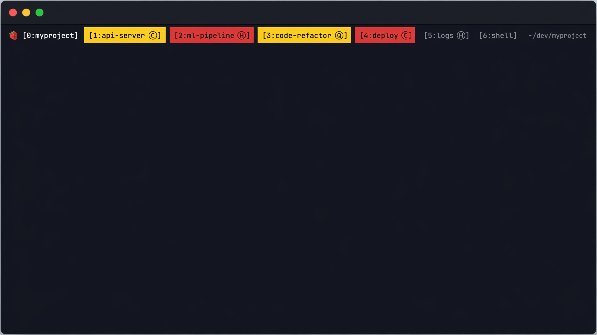

# tmux-ai-bar

> Tmux status bar for multi-agent workflows — see which AI agent is busy, done, or idle at a glance.



Color-coded tmux status bar that tracks AI agent activity across windows:

| Status | Meaning |
|---|---|
| **Yellow** | Agent is producing output (working) |
| **Red** | Silent for 8+ seconds (done or stuck — needs your review) |
| Default | Idle / reviewed / never active |
| Suffix | Auto-detected agent type via process inspection |

Built-in agent detection: Claude Code, Codex CLI, Gemini CLI, OpenCode, Hermes, Qoder CLI. Easy to add your own.

## Requirements

- tmux >= 3.0
- A true-color terminal (iTerm2, Warp, Ghostty, Alacritty, etc.)
- macOS (Linux support is untested)

## Install

```bash
# 1. Clone
git clone https://github.com/lijingcheng3359/tmux-ai-bar ~/dev/tmux-ai-bar

# 2. Back up existing config
[ -e ~/.tmux.conf ] && mv ~/.tmux.conf ~/.tmux.conf.bak.$(date +%Y%m%d)
mkdir -p ~/.tmux

# 3. Symlink
ln -s ~/dev/tmux-ai-bar/tmux.conf ~/.tmux.conf
ln -s ~/dev/tmux-ai-bar/agent-poll.sh ~/.tmux/agent-poll.sh

# 4. Start tmux
tmux kill-server   # warning: kills existing sessions
tmux new -s ai
```

Verify the poller is running:

```bash
pgrep -f agent-poll.sh   # should print a PID
```

## Usage

Run one agent per tmux window. The status bar shows activity at a glance:

```
[0:myproject]  [1:api-server]  [2:ml-pipeline]  [3:refactor]
  ^ you are here    ^ yellow = working   ^ red = review     ^ yellow = working
```

Switch to whichever window turns red first to review the output. Switching to a window automatically clears the red indicator.

**Keybindings** (prefix default: `Ctrl+J`):

| Key | Action |
|---|---|
| `prefix + r` | Reset current window status |
| `prefix + R` | Reload tmux.conf |

## Adding Custom Agents

Edit the `detect_agent` function in `agent-poll.sh` and add a pattern to the `case` statement:

```bash
case "$cmd" in
  *claude*|*"@anthropic-ai/claude"*) echo "C"; return ;;
  *hermes*) echo "H"; return ;;
  *qodercli*) echo "Q"; return ;;
  *your-agent*) echo "X"; return ;;   # <-- add here
esac
```

Note: the function has two identical `case` blocks (for child and grandchild processes) — update both. Then restart the poller:

```bash
pkill -f agent-poll.sh
tmux source-file ~/.tmux.conf
```

## Configuration

Tunable parameters at the top of `agent-poll.sh`:

| Variable | Default | Description |
|---|---|---|
| `SLEEP_INTERVAL` | `2` | Poll interval in seconds |
| `SILENT_THRESHOLD` | `4` | Rounds of silence before marking done (4 x 2s = 8s) |
| `GROWTH_THRESHOLD` | `1` | Rounds of output before marking active |
| `AGENT_DETECT_EVERY` | `3` | Rounds between agent type detection (3 x 2s = 6s) |
| `CAPTURE_EVERY` | `2` | Rounds between bottom-line hash captures (most expensive op) |
| `HERMES_MIN_GROWTH` | `128` | Hermes only: min `history_bytes` growth per round to count as output (filters idle heartbeats; other agents use 0) |

Status bar colors in `tmux.conf`:

```bash
bg=#ffcc00   # yellow (active)
bg=#ff3b30   # red (done)
```

## How It Works

- Background `agent-poll.sh` polls all windows every 2 seconds, detecting output activity via `history_bytes` growth
- Bottom 5-line hash detects in-place refreshes (spinners, timers); requires 2 consecutive changes to confirm (debounces sleep/wake artifacts)
- `pgrep` + `ps` walks the pane process tree (3 levels deep) to identify agent type by command-line keywords
- Switching to a window triggers `session-window-changed` hook, auto-clearing the done state
- Agent exit requires 2 consecutive detection misses before confirming (prevents false clears during fork/exec gaps)

## Known Limitations

- Shell built-in loops (`for i; echo`) keep `pane_current_command` as `zsh` — not detected as an agent
- Very short commands (< 1 second) may not be caught by the poller
- Agents with continuous spinner output stay yellow indefinitely and never trigger the done state

## Note

The included `tmux.conf` contains personal preferences (prefix remapped to `Ctrl+J`, vim mode, etc.). If you only want the agent status feature, copy the relevant sections into your own `tmux.conf`.

## License

[MIT](LICENSE)
